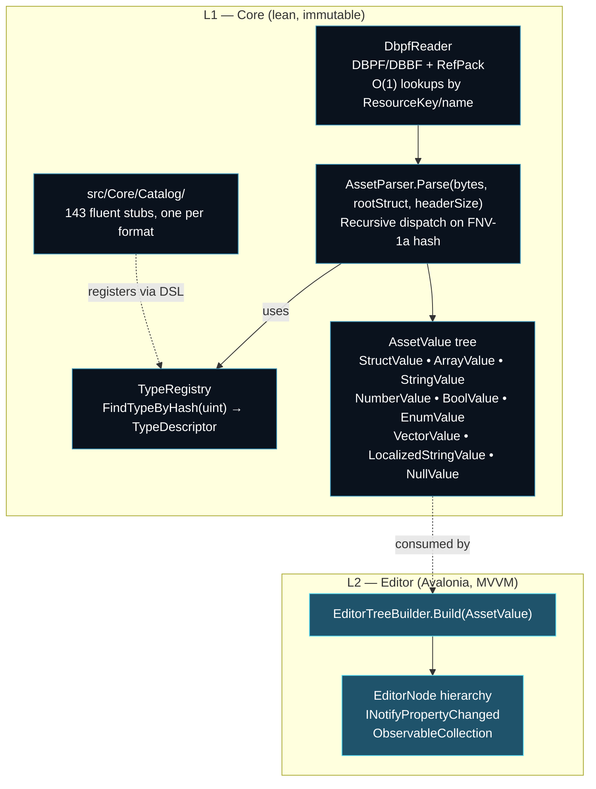

<div align="center">
  
</div>

<h1 align="center">AssetData.Parser</h1>
<p align="center">Binary asset parser for Darkspore (<code>.noun</code>, <code>.phase</code>, <code>.aicondition</code>, …) and DBPF packages. Mirrors the retail client's dispatch model: one generic recursive parser keyed by FNV-1a hash, one fluent DSL stub per format.</p>

---

## Architecture

Two layers. The parser core is pure POCO; observable bindings live in the editor adapter.



The dispatch in `AssetParser` mirrors `Darkspore.exe`'s `AssetParser::DeserializeObject` (0x009cd2c0): for each field, `TypeRegistry.FindTypeByHash(field.typeHash)` either resolves to a registered struct (recurse) or returns null, in which case the hash is a wire-shape sentinel (Array, Nullable, Asset, Key, CharPtr, Char, LocalizedAssetString, Enum) or a value type (Bool, Int, UInt32, Float, Vector2/3/4, Orientation, …) handled inline. Adding a new asset format means adding one fluent stub — no new parser code, no factory, no loader per format.

## Stack

- .NET 10, C# 14
- Central package management (`Directory.Packages.props`)
- Avalonia 11.3 — editor UI
- CommunityToolkit.Mvvm 8.4 — source-generated MVVM
- Microsoft.Extensions.DependencyInjection 10
- ReCap.CommonUI — UI components from the ReCap project (by Splitwirez)

## Usage

### CLI

```
dotnet run --project src/CLI -- -d AssetData_Binary.package -r registries -v -a PC_EL_Rogue.noun
```

Flags: `-d` DBPF package, `-r` registry directory, `-a` asset name (or `random:*:N` for batch parsing), `-v` verbose tree dump, `-o` XML output directory. Run with `-h` for the full list.

### As a library

```csharp
using AssetData.Parser;
using AssetData.Parser.Model;

using var dbpf = new DbpfReader("AssetData_Binary.package");
var service = new AssetService();

byte[]? bytes = dbpf.GetAsset("PC_EL_Rogue.noun");
AssetValue root = service.Load(bytes, "noun", headerSize: 8);

// Walk the tree — POCO, no INotifyPropertyChanged, no observable collections
foreach (var child in root.Children)
{
    switch (child)
    {
        case StringValue s when s.Kind == AssetValueKind.Asset:
            Console.WriteLine($"asset {s.Name} = {s.Value}");
            break;
        case NumberValue n:
            Console.WriteLine($"{n.OriginalType} {n.Name} = {n.Value}");
            break;
        case StructValue sub:
            Console.WriteLine($"struct {sub.Name} ({sub.TypeName})");
            break;
    }
}
```

### In the editor

The editor consumes the L1 tree and wraps each node in an `EditorNode` adapter that adds `INotifyPropertyChanged` for two-way binding:

```csharp
var value = await Task.Run(() => assetService.LoadFile(path));   // L1 (Core)
var editorRoot = EditorTreeBuilder.Build(value);                 // L2 (Editor)
ViewModel.SetRoot(editorRoot);
```

XML export round-trips through L1 again (`EditorToValue.Convert` → `AssetSerializer.ToXml`), so user edits are preserved.

## Adding a format

Drop a stub in `src/Core/Catalog/`:

```csharp
namespace AssetData.Parser.Catalog;

public sealed class MyFormat : AssetCatalog
{
    protected override void Build() => Struct("myFormat", size: 0x20,
        Field("id",      DataType.UInt32, 0x0),
        Asset("noun",                     0x4),
        Array("entries", DataType.Float,  0x10));
}
```

`AssetParser` discovers `AssetCatalog` subclasses via reflection at construction. The DSL helpers (`Field`, `Asset`, `Array`, `Nullable`/`NStruct`, `IStruct`, `EnumField`, `CharBuffer`, `LocalizedAssetString`) produce field descriptors that the registry resolves by FNV hash at parse time.

## Documentation

- [`docs/ARCHITECTURE.md`](docs/ARCHITECTURE.md) — as-is C# layout
- [`docs/ARCHITECTURE_REDESIGN.md`](docs/ARCHITECTURE_REDESIGN.md) — game-faithful blueprint, sentinel hash table, divergence list
- [`docs/IMPLEMENTATION_PLAN.md`](docs/IMPLEMENTATION_PLAN.md) — phased refactor with status

Ghidra ground truth (decompiled reflection system, per-format coverage, full address table) lives in the ReCap project under `docs/architecture/assetdata-system/`.

## Status

- Hash-keyed `TypeRegistry` + game-faithful dispatch — done
- Correctness fixes (`cAssetProperty`, drop fake `AssetPropertyVector` and `DataType.Struct`) — done
- Reflection / dead code removal, DbpfReader O(n) → O(1), single FNV — done
- L1/L2 node split (lean Core, `EditorNode` adapter) — done
- Per-format coverage — 143 stubs registered; ~184/500 batch failures remain, all pre-existing offset bugs in specific stubs (e.g. `EventListenerDef`), tracked as catalog work, not parser work

## TODO

- Binary serialization (write modified asset back to disk)
- Enum editing in the editor (combo box bound to enum table)
- Asset diff/compare
