# AssetData.Parser — Architecture (AS-IS)

Detailed map of the **current** architecture. This is the reference baseline; the **TO-BE** redesign (game-faithful, modern engineering) lives in [`ARCHITECTURE_REDESIGN.md`](ARCHITECTURE_REDESIGN.md). Read this first to understand what exists, then the redesign for where it's going.

> Reverse-engineering ground truth for the binary format: ReCap repo `docs/architecture/assetdata-system/GHIDRA_GROUND_TRUTH.md`.
> Generated 2026-05-26. Target framework migration to **.NET 10** is tracked in §10.

---

## 1. Purpose

Parse Darkspore's binary asset files (`AssetData_Binary.package` and loose `.bin`) into an inspectable tree, and provide a desktop editor + CLI + wiki generator over them. The binary contract is a reverse-engineered mirror of the client's own reflection-based serializer.

---

## 2. Solution topology

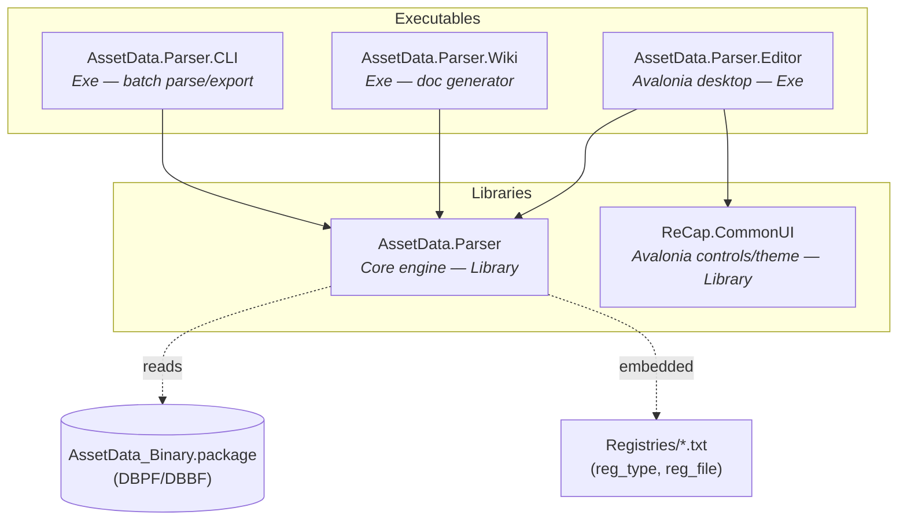

**Dependency direction is clean:** all consumers depend on `Core`; `Core` depends on nothing external (pure BCL). `Core` has **no** UI/DI/serialization-framework dependencies. The coupling smell is internal to `Core` (see §5e — the parser output type is an editor view-model).

---

## 3. Tech stack

| Project | Type | TFM | Lang | Key dependencies |
|---|---|---|---|---|
| `AssetData.Parser` (Core) | Library | net9.0 | C# 13 | none (BCL only) |
| `AssetData.Parser.CLI` | Exe | net9.0 | C# 13 | Core |
| `AssetData.Parser.Editor` | Exe (WinExe) | net9.0 | C# 13 | Avalonia 11.3.11, CommunityToolkit.Mvvm 8.4.1-build.4, Microsoft.Extensions.DependencyInjection 9.0.0, Core, CommonUI |
| `ReCap.CommonUI` | Library | net9.0 | default | Avalonia 11.3.8, FluentAvaloniaUI 2.0.5, Avalonia.ReactiveUI, System.Reactive 6.0.1 |
| `AssetData.Parser.Wiki` | Exe | net9.0 | C# 13 | Core |

**Version drift to fix during the .NET 10 sweep:** Avalonia `11.3.11` (Editor) vs `11.3.8` (CommonUI); `CommunityToolkit.Mvvm` is on a **preview** build (`8.4.1-build.4`); `Microsoft.Extensions.DependencyInjection 9.0.0`; `ReCap.CommonUI` has `Nullable` **disabled**.

---

## 4. Layered view

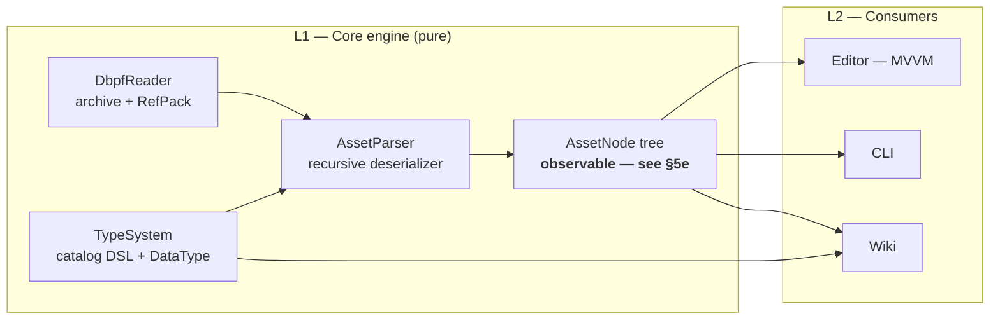

> **Architectural note:** today there is no clean L1/L2 boundary on the *output* — `AssetNode` (the parser's product) carries MVVM (`INotifyPropertyChanged`, `ObservableCollection`) and UI concerns (`DisplayValue`, `IsEditable`). That makes L1 ship the editor's model. The redesign separates these.

---

## 5. Core engine

### 5a. Type system (`Core/TypeSystem.cs`)

A fluent DSL describes each binary format. `DataType` is an enum whose **values are the FNV-1a hashes** of the client's canonical type names (sentinels + value types).

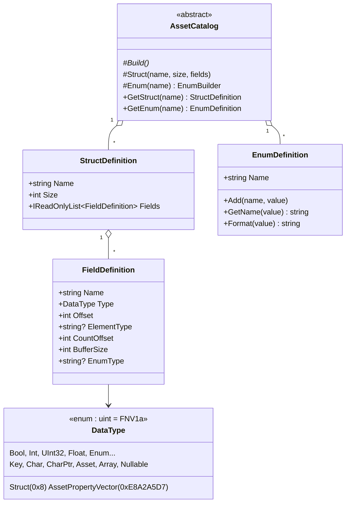

> `DataType.Struct = 0x00000008` and `AssetPropertyVector = 0xE8A2A5D7` are **fabricated/dead** vs the client (see redesign §3). Fields keep definition order — blob data follows declaration order, not offset order.

### 5b. Catalog organization (143 format definitions)

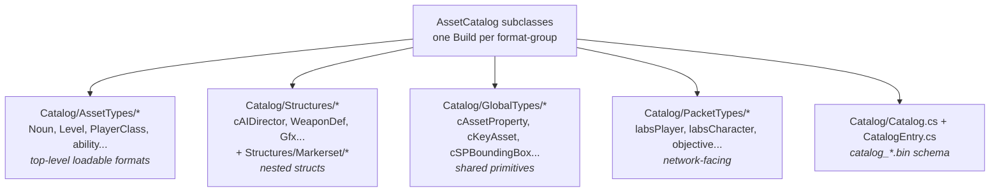

Registration is **reflection-driven** at `AssetParser` construction:

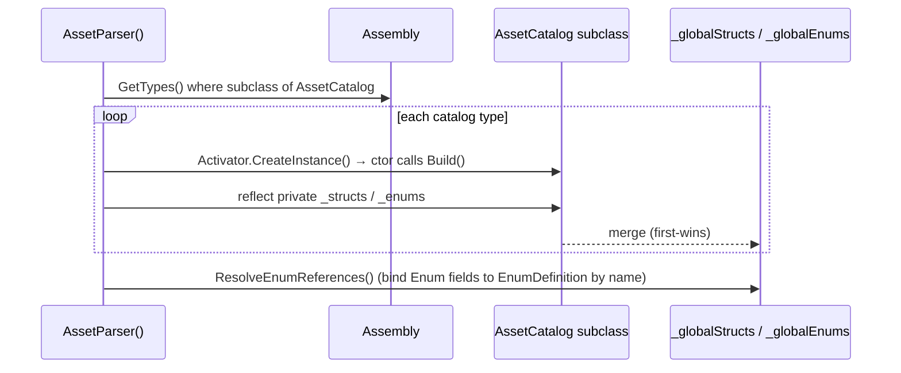

> Merging via **private-field reflection** (`MergeCatalog`) is a fragility flagged in the redesign (D6).

### 5c. DBPF archive reader (`Core/DbpfReader.cs`)

```mermaid
flowchart TD
    Open[open package] --> Magic{magic}
    Magic -->|DBPF| V32[32-bit index offsets]
    Magic -->|DBBF| V64[64-bit index offsets]
    Magic -->|other| Err[InvalidDataException]
    V32 & V64 --> Idx[read index header<br/>flags: shared type/group id]
    Idx --> Loop[read N entries<br/>ResourceKey + offset + sizes + compressionFlag]
    Loop --> Names[LoadInternalNames<br/>sporemaster/names → projectRegistry]
    Names --> Ready[(Entries ready)]

    Ready --> Get["GetAsset(name|key)"]
    Get --> Resolve["Resolve(name): fileRegistry/projectRegistry/FNV<br/><b>O(n) scan of Entries</b>"]
    Resolve --> Read["ReadEntry: seek+read<br/>IsCompressed? RefPackDecompress"]
    Read --> Bytes[(byte&#91;&#93; payload)]
```

- **Name resolution:** three `NameRegistry` instances — `reg_type.txt` + `reg_file.txt` (embedded resources) + `sporemaster/names` (in-package). The C# stand-in for the client's `catalog_*.bin` name table.
- **RefPack** (EA QFS) decompression implemented inline.
- **Hot spots:** `GetAsset` / `Resolve` / `LoadInternalNames` linear-scan `Entries` (the client uses hash buckets). Tracked in redesign §9.

### 5d. Parser pipeline (`Core/AssetParser.cs`)

Two-region layout per asset: a fixed **header** (struct instance, fields at fixed offsets) + a **blob** (variable data: strings, arrays, nested structs). A `BlobReader` cursor walks the blob sequentially **in field-declaration order**.

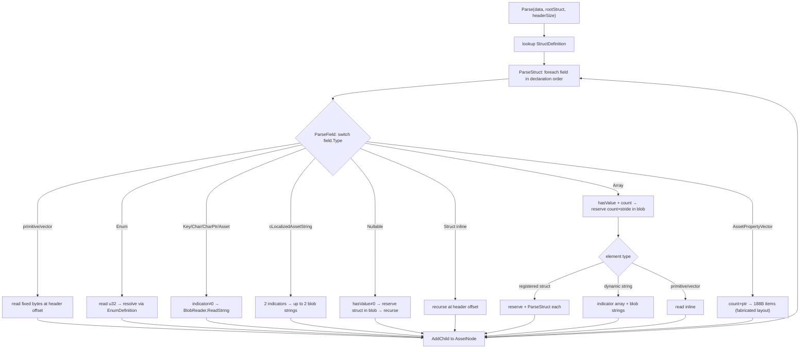

> This is the C# analogue of the client's `DeserializeObject`. Differences (string-keyed dispatch, `DataType.Struct`, `AssetPropertyVector`) are in redesign §3.

### 5e. AssetNode output model (`Core/AssetNode.cs`)

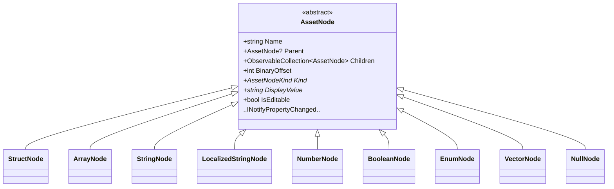

> **Key smell:** `INotifyPropertyChanged`, `ObservableCollection`, `IsEditable`, `DisplayValue` are **editor/UI** concerns living in the parser's output. The client's parsed object is a plain struct. See redesign §9 (biggest architectural fix).

---

## 6. End-to-end data flow

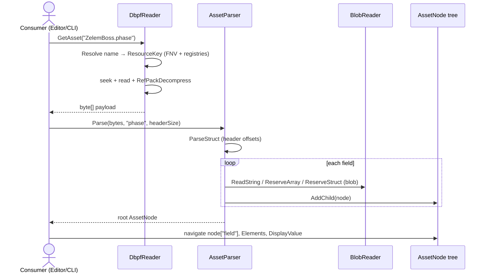

---

## 7. Editor architecture (`src/Editor`, Avalonia MVVM)

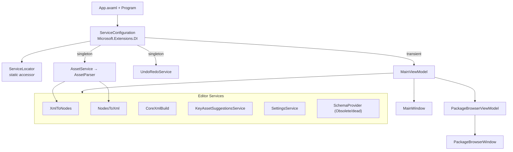

- **DI:** `Microsoft.Extensions.DependencyInjection` via `ServiceConfiguration` + a static `ServiceLocator` (service-locator anti-pattern, used "sparingly").
- **Model:** consumes Core's `AssetNode` **directly** as the view-model (hence Core's observability). Editing flows through `UndoRedoService`.
- **XML round-trip:** `XmlToNodes` / `NodesToXml` / `CoreXmlBuild` convert between the node tree and the editor's `.xml` representation.
- **Suggestions/browse:** `KeyAssetSuggestionsService` + `PackageBrowserViewModel` need a package-wide name/key/type index but currently lean on `DbpfReader.ListAssets` (O(n)).

---

## 8. CLI & Wiki

- **CLI** (`src/CLI/Program.cs`): argument-parsed batch tool — `-d/--dbpf`, `-a/--asset`, `-r/--registries`, `-o/--output`, `--xml`, `--list`, type filter, random seed. Recognizes `catalog_N.bin` via a `[GeneratedRegex]`. Parses one asset or lists/exports the package.
- **Wiki** (`src/Wiki/Program.cs`): generates documentation from the registered schema (`AssetParser.Structs`/`Enums`). Schema-introspection consumer, no binary parse needed.

---

## 9. Cross-cutting concerns

| Concern | Where | Note |
|---|---|---|
| **FNV-1a hash** | `DbpfReader.FnvHash`, `EnumBuilder.FnvHash`, baked `DataType` values | **3 implementations** of the same hash — consolidate to one. |
| Name → hash resolution | `NameRegistry` (×3) + embedded `Registries/*.txt` | Could be seeded from `catalog_*.bin`. |
| Header/blob split | `AssetParser` + `BlobReader` | Cursor advances in field-declaration order — invariant, easy to break. |
| Schema introspection | `AssetParser.Structs`/`Enums` | Used by Wiki + Editor; the public schema surface. |
| Error context | `ParseField` try/catch wraps with field+struct+offset | Good diagnostics; keep. |

---

## 10. .NET 10 migration notes

Goal: move all five projects to **.NET 10** and modernize.

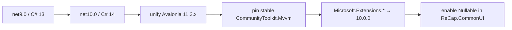

Mechanical checklist:
1. Bump every `<TargetFramework>net9.0</TargetFramework>` → `net10.0`; `<LangVersion>13</LangVersion>` → `14` (or remove to track SDK default).
2. Align Avalonia to a single 11.3.x across Editor + CommonUI (currently 11.3.11 vs 11.3.8).
3. Replace the `CommunityToolkit.Mvvm 8.4.1-build.4` **preview** with the latest stable.
4. Bump `Microsoft.Extensions.DependencyInjection` 9.0.0 → 10.0.0.
5. Turn on `<Nullable>enable</Nullable>` in `ReCap.CommonUI` (currently disabled) — expect warnings to triage.
6. Consider a `Directory.Build.props` to centralize TFM/LangVersion/Nullable, and a `Directory.Packages.props` for **central package management** (eliminates version drift).

> These are independent of the binary-format redesign. The .NET 10 sweep can land first as a low-risk modernization pass, then the registry/layering refactor on top.

---

## 11. Known issues & where they're tracked

All correctness/model/architecture issues are enumerated in [`ARCHITECTURE_REDESIGN.md`](ARCHITECTURE_REDESIGN.md):
- §3 — divergences from the client (fabricated `DataType.Struct`, wrong `AssetPropertyVector`, string-keyed dispatch, reflection merge).
- §9 — per-module audit (observable `AssetNode` in L1, O(n) DbpfReader, dead `SchemaProvider`, XML in Core).

Next step (per the debate): use this AS-IS map + the redesign to plan the modern-engineering target — clean L1/L2 split, hash-keyed registry, central package management, .NET 10.
