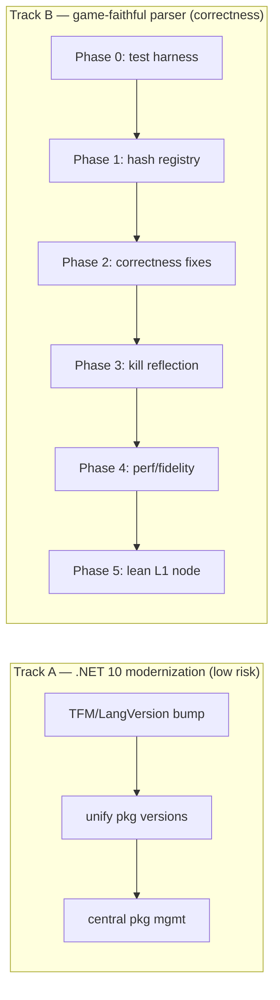

# AssetData.Parser — Implementation Plan

Turns the [`ARCHITECTURE_REDESIGN.md`](ARCHITECTURE_REDESIGN.md) blueprint into ordered, code-grounded work. Read [`ARCHITECTURE.md`](ARCHITECTURE.md) (AS-IS) and the redesign (TO-BE) first; this doc is the *how/when*, mapped to real files, methods, and line ranges in `src/Core`.

> **Generated 2026-05-26.** Verified against the working tree, not just the blueprint — discrepancies between the redesign's claims and the actual code are flagged inline as ⚠️ and folded into the relevant phase.

## Status (2026-05-26)

| Phase | State | Notes |
|---|---|---|
| Track B Phase 1 (hash registry + dispatch) | ✅ done | `src/Core/TypeModel/*`; `ParseField` dispatches via `FindTypeByHash`. A/B verified (316/184 vs 314/186, no regressions). |
| Track B Phase 2 (correctness) | ✅ done | Fixed `cAssetProperty` layout; `cAICondition` → `array<cAssetProperty>`; deleted `AssetPropertyVector`. `DataType.Struct` kept as documented DSL-only marker (physical removal needs the descriptor migration). |
| Track B Phase 3 (kill reflection / dead code) | ✅ done | `MergeCatalog` reflection → explicit accessors; deleted `SchemaProvider`; renamed `DirectorBucket..cs`; dropped `DataType.UInt`/`Int_Legacy`. **Did NOT** rename `AssetCatalog`→`AssetTypeStub` (cosmetic, 143-file churn — deferred). |
| Track B Phase 4 (perf) | ✅ done | DbpfReader `_byKey`/`_byInstance` indices (O(n)→O(1)); 3 FNV copies → `WireHash.Fnv1a`. |
| Track B Phase 1c (array/nullable element dispatch via registry) | ⬜ deferred | Optional fidelity; element lookup still uses `_globalStructs`. Output-identical either way. |
| Track B Phase 5 (lean L1 node model) | ⬜ pending | Largest change — breaks the `AssetNode` contract, needs Editor `EditorNode` adapter. Own milestone. |
| Track A (.NET 10 sweep) | ⬜ pending | Independent; not started. |
| Known catalog gaps | — | `cPlayerCrystal` struct undefined (1 unresolved registry ref); ~184/500 batch failures are pre-existing offset bugs (EventListenerDef etc.). |

---

## 0. Reconciliation — blueprint vs. working tree

Before committing to the redesign's phase list, three of its assumptions are stale. The plan accounts for them.

| Redesign claim | Reality in tree | Impact |
|---|---|---|
| "exactly two defs declare `AssetPropertyVector`: `PacketTypes/ability.cs` and `Structures/cAICondition.cs`" | Only **`Structures/cAICondition.cs:11`** still uses `DataType.AssetPropertyVector`. In `ability.cs:67` it is already **commented out** (`// IStruct("properties", "tAssetPropertyVector", …) // TODO`). | Phase 2 fix target shrinks to **one** live field + one TODO to wire up. |
| "`IStruct`/inline-struct is used in 11 defs" | `IStruct(...)` appears in **~13** defs (Noun, ObjectExtents ×18 fields, labsPlayer, cLocomotionData, EditorPrefs, Markerset/*, Condition, …). | More rows touch the Phase-1 hash-recursion path; all are mechanical, but the golden test must cover them. |
| "`cAssetProperty`/`cAssetPropertyList` — confirmed correct, keep" | `GlobalTypes/cAssetProperty.cs` exists but is **buggy**: it declares `key` **twice** (`0x0` and `0x54`) and never declares the `type` discriminator at `0x54`. Per redesign §4.3 the layout is `key u32@0`, `name char[80]@4`, `type u32@0x54`, `value char[80]@0x58`. | Phase 2 must *fix* this struct, not just keep it. The `value` field is also `UInt32` today, not the `char[80]` the blueprint specifies. |

**There is no test project anywhere in the solution.** The redesign's "regression guard" (§6) is a prerequisite, not an afterthought — it becomes Phase 0 here.

⚠️ **Placeholder structs with all-zero offsets exist and produce wrong output today.** Confirmed example: `Structures/cThumbnailCaptureParameters.cs` declares all 15 fields at `offset 0`, so every float reads the same 4 bytes. A live run of `PC_EL_Rogue.noun` shows `fovY = nearPlane = farPlane = cameraScale = mouseCameraOffset = 26.9261189`, all three `cameraRotation_*` equal to `cameraPosition`, and `poseAnimID = 1104636081` (= `0x41D77BF1`, the float bits of `26.926…` reinterpreted). This is **not** a redesign concern — it's an incomplete field map. Consequence for Phase 0: the golden baseline would lock in this garbage as "correct." See §7 (manual acceptance test) and the Phase-0 triage step.

---

## 1. Two independent tracks

The work splits into two streams that do **not** depend on each other and can land in either order (or in parallel):



**Recommendation:** land **Track A first** (mechanical, reviewable, unblocks nothing but de-risks everything), then **Track B Phase 0** (the safety net), then Track B core phases. Track B Phase 0 is the gate for every subsequent Track B phase.

---

## 2. Track A — .NET 10 modernization sweep

Source of truth: `ARCHITECTURE.md` §10. Each step compiles and is independently committable.

| Step | Action | Files | Verify |
|---|---|---|---|
| A0 | Add `Directory.Build.props` (root) centralizing `<TargetFramework>net10.0</TargetFramework>`, `<LangVersion>14</LangVersion>` (or unset → SDK default), `<Nullable>enable</Nullable>`. | new `Directory.Build.props` | `dotnet build` |
| A1 | Remove per-project `<TargetFramework>`/`<LangVersion>` now covered by the props file; bump any that resist. 5 projects: Core, CLI, Editor, Wiki, ReCap.CommonUI. | `src/*/*.csproj` | `dotnet build` |
| A2 | Add `Directory.Packages.props` (central package management) and move every `<PackageReference Version=…>` into it as `<PackageVersion>`. Kills the drift. | new `Directory.Packages.props`, all `.csproj` | `dotnet restore` |
| A3 | Unify Avalonia to one 11.3.x (Editor `11.3.11` vs CommonUI `11.3.8` → pick highest). | `Directory.Packages.props` | Editor launches |
| A4 | Replace `CommunityToolkit.Mvvm 8.4.1-build.4` **preview** → latest stable. | `Directory.Packages.props` | Editor launches |
| A5 | Bump `Microsoft.Extensions.DependencyInjection 9.0.0` → `10.0.0`. | `Directory.Packages.props` | Editor launches |
| A6 | `ReCap.CommonUI` had `<Nullable>` disabled — now inherited as `enable` from A0. Triage the warnings (expect several). | `ReCap.CommonUI/*.cs` | `dotnet build` warns→clean |

> A6 is the only step that can produce real work (nullable warnings). If it balloons, scope it to its own PR with `<Nullable>annotations</Nullable>` as an interim.

---

## 3. Track B — game-faithful parser

### Phase 0 — Regression harness (PREREQUISITE, no production code)

The redesign demands every later phase keep the `AssetNode` tree byte-identical (except the intended Phase-2 `cAssetProperty` change). That guard does not exist yet.

1. Add `tests/AssetData.Parser.Tests` (xUnit), referencing Core. Wire into `AssetData.Parser.sln`.
2. Add the existing `src/Assets/AssetData_Binary.package` as a test fixture (it is already in the repo).
3. **Golden snapshot test:** enumerate every entry in the package via `DbpfReader.ListAssets`, parse each with `AssetParser`, serialize the resulting tree to XML via `AssetSerializer.ToXml`, and write per-asset `.xml` snapshots under `tests/__snapshots__/`. Provide an `UPDATE_SNAPSHOTS=1` env switch.
4. **Coverage assertions:** the snapshot set must include at least one asset exercising each of: inline struct (`IStruct` → Noun/ObjectExtents), `Nullable` (NStruct), `Array<struct>`, `Array<primitive>`, `Array<string>`, `cLocalizedAssetString`, `Enum`, and the `AssetPropertyVector` field (`cAICondition`). Fail the test if any category has zero coverage so Phase 1/2 can't silently skip a code path.
5. **Triage known-bad defs before baselining.** A golden snapshot captures *current* output, including bugs. Before committing the baseline, grep for placeholder structs whose fields all share one offset (the `cThumbnailCaptureParameters` pattern — all-zero offsets) and either (a) fix the field map from Ghidra ground truth first, or (b) mark each known-bad asset with a `// KNOWN-BAD: <reason>` annotation in the snapshot so a future fix is an *expected* diff, not a silent regression lock-in. At minimum, fix `cThumbnailCaptureParameters` (size 108, offsets currently all `0`) so the `PC_EL_Rogue.noun` baseline is real.
6. Commit the snapshots. **Green = the safety net is armed.**

> Output: a single `dotnet test` that fails loudly if any tree changes. Every phase below ends with "snapshots unchanged" unless stated otherwise.

---

### Phase 1 — Hash-keyed registry + unified dispatch

Goal: replace string-keyed lookup + per-field `DataType` switch with `FindTypeByHash` + sentinel dispatch, **without** changing the DSL or the output tree. Mirrors `DeserializeObject 0x009cd2c0`.

**New files** (`src/Core/TypeModel/`):
- `WireHash.cs` — the sentinel + value-type FNV constants (lift today's `DataType` enum values; redesign §4 table). One source of truth for the hashes.
- `TypeRegistry.cs` — `Dictionary<uint, TypeDescriptor>` + `Register(descriptor)` + `FindTypeByHash(uint) → TypeDescriptor?`. Keep a thin `name→hash` map only for `GetFileType(extension)`.
- `TypeDescriptor.cs` — `{ Name, TypeHash, Size, IReadOnlyList<FieldDescriptor> Fields }`.
- `FieldDescriptor.cs` — `{ Name, NameHash, TypeHash, Offset, ElementHash, CountOffset, BufferSize, EnumTable }`. Replaces `FieldDefinition.ElementType:string` (D5) with `ElementHash:uint`.

**Step 1a — Adapter (additive, zero behavior change).** Build a converter that walks the existing `_globalStructs : Dictionary<string, StructDefinition>` (`AssetParser.cs:60`) and emits `TypeDescriptor`s into a `TypeRegistry`, computing each field's `TypeHash`/`ElementHash` via the **single** FNV-1a (see §4 below). Run it alongside the old path; assert the registry resolves every struct the old dict had. No snapshot change.

**Step 1b — Rewrite the deserializer.** Replace `ParseField`'s `switch (field.Type)` (`AssetParser.cs:246-413`) with the redesign §4.1 dispatch:
```
sub = registry.FindTypeByHash(f.TypeHash)
if sub != null  → recurse (this absorbs DataType.Struct, see Phase 2)
else            → switch on the sentinel hash (Asset/Nullable/Key/Localized/CharPtr/Char/Array/Enum) else value-type
```
Keep the existing `Parse…Field` reader bodies verbatim — only the *dispatch* changes. The blob cursor invariant (field-declaration order, `BlobReader`) is unchanged.

**Step 1c — Array element dispatch** (`ParseArrayField`, `AssetParser.cs:527-655`): replace `_globalStructs.TryGetValue(field.ElementType)` + `Enum.TryParse<DataType>(field.ElementType)` with `registry.FindTypeByHash(field.ElementHash)`. Keep the `cLocalizedAssetString`/`Asset` string-array superset (D7) — document it as a harmless deviation from the client.

**Gate:** snapshots **unchanged**. This is the medium-risk phase; the golden test is what makes it safe.

---

### Phase 2 — Correctness fixes (the only intended snapshot change)

Two real bugs (redesign D2, D3). Do these only after Phase 1 is green.

**2a — Kill `DataType.Struct` (D2).** It is fabricated (`TypeSystem.cs:109`, value `0x00000008`). After Phase 1, inline structs already resolve through `FindTypeByHash` (the *first* dispatch check), so:
- Remove `DataType.Struct` from the enum and `ParseInlineStructField` (`AssetParser.cs:778-792`).
- The `IStruct(...)` DSL helper (`TypeSystem.cs:361`) keeps its signature but now produces a field whose `TypeHash = FNV1a(structType)` instead of `DataType.Struct` — the ~13 call sites (Noun, ObjectExtents, Condition, labsPlayer, cLocomotionData, EditorPrefs, Markerset/*) need **no row edits**.
- Snapshots for those assets must stay identical (inline struct → struct recursion is the same tree).

**2b — Fix `cAssetProperty` + kill `AssetPropertyVector` (D3).** This is the one **intended** snapshot diff.
- Fix `GlobalTypes/cAssetProperty.cs` (currently buggy — duplicate `key`, missing `type`, wrong `value` type) to the verified layout (size `0xBC`):
  `key u32@0x00`, `name char[80]@0x04`, `type u32@0x54`, `value char[80]@0x58`.
- Convert the one live consumer, `Structures/cAICondition.cs:11`, from `Field("properties", DataType.AssetPropertyVector, 0x68)` to `Array("properties", "cAssetProperty", 0x68)` (array of `cAssetProperty`, per redesign §4.3).
- Wire up the commented-out `ability.cs:67` `properties` field the same way (`array<cAssetProperty>`) — confirm offset `0x1a8` and stride against the package.
- Delete `DataType.AssetPropertyVector` (`TypeSystem.cs:102`), `ParseAssetPropertyVectorField` (`AssetParser.cs:657-687`), `ParseAssetPropertyItem` (`689-748`), and the `GetSize`/extension entries referencing it.
- **Update the snapshot** for `cAICondition`-bearing and ability assets — review the diff by hand to confirm it now shows real `key/name/type/value` rows instead of the `VariantData [172 bytes]` hexdump.

**Open verification** (redesign §8, do during 2b): confirm `cAssetProperty.value` never exceeds the 80-byte inline buffer in any real asset; confirm the `name`@0x04 offset and the ~20-byte tail (0xA8..0xBC). Decompile a real `.noun`/`.aicondition` carrying properties if the snapshot looks wrong.

---

### Phase 3 — Kill reflection, rename, delete dead code (mechanical)

Low risk, compiler-checked. After Phase 2 green.

- Replace `MergeCatalog` private-field reflection (`AssetParser.cs:160-189`, reads `_structs`/`_enums` via `BindingFlags.NonPublic`) with an explicit `stub.Build(registry)` call (redesign D6). The `InitializeCatalogs` reflection that *discovers* subclasses (`AssetParser.cs:94-106`) can stay or move to explicit registration — discovery-by-reflection is acceptable; reading private fields is the smell.
- Rename `AssetCatalog` → `AssetTypeStub`; change `protected abstract void Build()` → `Build(TypeRegistry r)`. All ~143 defs change base class + `Build` signature only (mechanical sweep, compiler catches misses).
- Delete dead `Editor/Services/SchemaProvider.cs` (already `[Obsolete]` "can be safely deleted").
- Fix the double-dot filename `Structures/DirectorBucket..cs` (redesign §8.5).
- Remove the legacy `DataType.UInt = 0x54CC76D5` alias (`TypeSystem.cs:113`) if grep confirms it's unused.

**Gate:** snapshots unchanged.

---

### Phase 4 — Performance & optional fidelity (independent)

Can land any time after Phase 1; not required for correctness.

- **DbpfReader O(n) → O(1)** (`ARCHITECTURE.md` §5c, redesign §8): build `Dictionary<ResourceKey, DbpfEntry>` + `Dictionary<uint instanceId, DbpfEntry>` once in the ctor; route `GetAsset`/`Resolve`/`LoadInternalNames` through them. This is also a quick-win that can jump ahead of Phase 1 if the Editor's package browser feels slow.
- **Consolidate the 3 FNV-1a implementations** (`DbpfReader.FnvHash`, `EnumBuilder.FnvHash` at `TypeSystem.cs:404`, baked `DataType` values) into one `WireHash.Fnv1a` (from Phase 1). Prerequisite for the registry being self-consistent — pull this earlier if convenient.
- **Optional fidelity:** `TypeDescriptor.FlattenedSize` (mirror `IndexType`) and `Fingerprint` (recursive structural FNV, mirror `BuildTypeMetadata 0x009f43e0`) → enables a MemoryPack disk cache keyed by fingerprint. Nice-to-have only.
- **Optional:** seed names from `catalog_*.bin` via the existing `Catalog`/`CatalogEntry` parser instead of the embedded `reg_*.txt` (redesign §8) — fewer external file deps.

---

### Phase 5 — Lean L1 node model (largest architectural change, do last)

The biggest smell (`ARCHITECTURE.md` §5e, redesign §9): `AssetNode` carries `INotifyPropertyChanged`, `ObservableCollection`, `IsEditable`, `DisplayValue` — editor concerns in the parser's output. Gate this **behind everything above** and behind the golden test.

1. L1 Core emits a lean immutable tree (POCO + `IReadOnlyList`, no INPC / no `DisplayValue` / no `IsEditable`).
2. L2 Editor adds an `EditorNode` adapter (INPC + undo + display) over the lean tree. Touch points confirmed: `Editor/.../PackageBrowserViewModel`, `Services/XmlToNodes`, `MainViewModel`, `UndoRedoService`.
3. L2 Server/Wiki read the lean tree directly.
4. Move `AssetSerializer.ToXml` out of Core into a Serialization/Editor module (XML is editor-mode only in the client) — note this also affects the Phase-0 golden test, which currently calls `AssetSerializer.ToXml`; keep a Core-side test serializer or move the test with it.

> This is the one phase that *intentionally* breaks the `AssetNode` contract. Sequence it as its own milestone with its own consumer-migration PRs.

---

## 4. Cross-cutting: the single FNV-1a

Phases 1–4 all assume one hash function. There are **3 copies** today. Lift `EnumBuilder.FnvHash` (`TypeSystem.cs:404-413`, case-insensitive, init `0x811C9DC5`, prime `0x1000193`) into `WireHash.Fnv1a(string)` and route `DbpfReader` + the registry through it. Add a unit test pinning known hashes (e.g. `asset = 0x9C617503`, `Nullable = 0x71AB5182`) so a future refactor can't silently change the hash and corrupt every lookup.

---

## 5. Sequencing summary

| Order | Work | Risk | Snapshot effect |
|---|---|---|---|
| 1 | Track A (.NET 10 sweep, A0–A6) | low | n/a (no tests yet) |
| 2 | Phase 0 — test harness + golden snapshots | none (additive) | **baseline created** |
| 3 | §4 single FNV-1a (+ hash unit test) | low | unchanged |
| 4 | Phase 1 — hash registry + dispatch | medium | unchanged |
| 5 | Phase 2 — correctness (`cAssetProperty`, drop `Struct`/`APV`) | medium | **intended diff, reviewed** |
| 6 | Phase 3 — kill reflection, rename, delete dead | low | unchanged |
| 7 | Phase 4 — DbpfReader keying, fidelity | low | unchanged |
| 8 | Phase 5 — lean L1 node model | high | **intended contract change** |

Phases 4 can interleave earlier (DbpfReader keying and FNV consolidation are independent quick-wins). Phase 5 is a separate milestone.

---

## 6. Manual acceptance test (run after implementation)

Beyond `dotnet test`, drive the real CLI against the **full game package** (13,800 entries — larger than the `src/Assets` fixture) and eyeball a known asset:

```
dotnet run --project src/CLI -- ^
  -d C:\CodingProjects\Personal\Darkspore\Data\AssetData_Binary.package ^
  -r C:\CodingProjects\Personal\AssetData.Parser\src\Assets\registries ^
  -v -a PC_EL_Rogue.noun
```

Two distinct paths: `-d` points at the **real game data** (`…\Darkspore\Data\…`), `-r` at the **repo's embedded registries** (`src/Assets/registries`). Expect `Entries: 13800`.

**Acceptance checks on the `PC_EL_Rogue.noun` dump:**
- Root resolves as `Struct.noun(Noun)` with `nounType = Creature`, `assetId = 2839215905`, asset refs resolving to real names (`PC_EL_Rogue.PlayerClass`, `RoguePL_v0.CharacterAnimation`, `DefaultPhysics.prop`).
- `bbox`, `locomotionTuning` show distinct, sane per-field values.
- ✅ **`creatureThumbnailData (cThumbnailCaptureParameters)` must show distinct values per field** — `fovY`, `nearPlane`, `farPlane`, `cameraScale`, the three `cameraRotation_*`, and the `mouseCamera*` fields must **not** all be `26.9261189`, and `cameraRotation_*` must differ from `cameraPosition`. If they're still identical, the offset map is still wrong (see §3 Phase-0 triage / §0 ⚠️).
- Known follow-ups visible in the current dump, not blockers: several `Asset.*Effect(UNKNOWN)` (unresolved refs) and an empty `Struct.componentData(SharedComponentData)` — note whether these are expected-null or unfinished field maps.

Capture this dump as a checked-in reference (`docs/samples/PC_EL_Rogue.noun.txt`) once the thumbnail offsets are fixed, so it doubles as a human-readable companion to the XML golden snapshots.

---

## 7. Definition of done per phase

- Compiles clean (`dotnet build`, Track A also: no new nullable warnings).
- `dotnet test` green, snapshots unchanged — **except** Phase 2 (reviewed intentional diff) and Phase 5 (new contract + migrated consumers).
- No new reflection-over-private-state (Phase 3 removes the existing one).
- Editor still launches and opens the package (manual smoke check after Track A and Phase 5).
